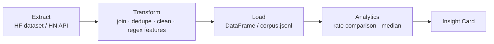

# Project1-Text_Analytics69

# Text Analytics for Business Insight

**วิชา SC663402 Data Warehouse and Big Data Analytics** · ทีม *เบื่อเกี้ยวอยากเคี้ยวข้าว*
ส่งงาน: อังคาร 6 ต.ค. 2569 · นำเสนอ: พุธ 7 ต.ค. 2569 (10 นาที + Q&A)

โครงงานนี้เปลี่ยน **ข้อความดิบ** ให้เป็น **ข้อเสนอที่ทีมธุรกิจนำไปทำต่อได้** ใน 2 ส่วน:
**Part 2** วิเคราะห์เสียงลูกค้าจากรีวิว Amazon และ **Part 3** สร้างชุดข้อมูลเองด้วย API แล้วหา Insight

---

## 1. ภาพรวม

| | Part 2 — Voice of Customer | Part 3 — Data Collection Robot |
|---|---|---|
| **โจทย์** | Brief B3 (ทีม Marketing): ลูกค้าที่ประทับใจพูดถึงอะไร เอาไปทำ Ad Copy / Claim อย่างไร | หัวข้อบน Hacker News กลุ่มใด (จัดด้วย keyword) มี engagement ต่างกันอย่างไร |
| **ข้อมูล** | Amazon Reviews 2023 หมวด `Digital_Music` สุ่ม 20,000 รีวิว | Hacker News Official API (Top Stories 250 รายการ) |
| **1 record คือ** | 1 รีวิว | 1 โพสต์ข่าว |
| **เทคนิค** | Regex Aspect Features, Rate Comparison, Genre Segmentation, Reality Check | Keyword-based Classification, Median Engagement Comparison |
| **ข้อมูลหลังคลีน** | 19,962 รีวิว | 241 โพสต์ (เกณฑ์ ≥ 200 ผ่าน) |
| **ผลลัพธ์หลัก** | Insight Card 2 ใบ | Insight Card 1 ใบ |

---

## 2. ทีมและการแบ่งงาน

| ส่วน | งาน | ผู้รับผิดชอบ |
|---|---|---|
| Part 2 | รีวิวที่สุ่มมาอย่างเหมาะสม | นาวสาวประภาพร กุลโต |
| Part 2 | Text Features | นาวสาวณนัดดา รัตนาตรี |
| Part 2 | Insight Card | นาวสาวสุกัญญา อุดมกัน |
| Part 2 | Reality Check | นายอุดมศักดิ์ พระเสนา |
| Part 2 | กราฟหลักสำหรับสื่อสาร | นาวสาวอาทิติญา ชาชัย |
| Part 3 | ข้อมูลที่ทีมเก็บเองด้วย API | นายเยี่ยมภพ ใบโพธิ์ |

---

## 3. โครงสร้างไฟล์

```
├── Project1_Text_Analytics69_Teams.ipynb        # Part 2 (+ หัวข้อโจทย์)
├── Project1_Text_Analytics69_Teams_Part3.ipynb  # Part 3
├── corpus.jsonl                                 # ผลลัพธ์ Part 3 หลังคลีน (241 records)
├── images/                                      # กราฟที่ใช้ใน README
└── README.md
```

---

## 4. วิธีรัน (Google Colab)

1. เปิด Notebook ใน Colab แล้วรันเซลล์ตามลำดับจากบนลงล่าง
2. **Part 2** ต้องต่ออินเทอร์เน็ต เพื่อดาวน์โหลดไฟล์ review (78.8 MB) และ metadata (67.1 MB) จาก Hugging Face
3. **Part 3** ต้องรัน 3.1 (เก็บข้อมูล) → 3.2 (คลีน + บันทึก `corpus.jsonl`) → 3.3 (วิเคราะห์) ตามลำดับ เพราะ 3.3 อ่านข้อมูลจาก `corpus.jsonl`
4. Part 2 กำหนด `RANDOM_SEED = 42` และ `SAMPLE_N = 20_000` ไว้ที่เซลล์ setup ทำให้ผลสุ่มซ้ำได้

**Library หลัก:** `pandas`, `numpy`, `matplotlib`, `seaborn`, `nltk`, `huggingface_hub`

---

## 5. แนวคิดเชิงข้อมูล (เชื่อมกับเนื้อหาวิชา)



| ขั้นตอน | Part 2 | Part 3 |
|---|---|---|
| **Extract** | ดาวน์โหลดไฟล์ JSONL + สุ่มแบบ Reservoir Sampling | เรียก API ทีละ item พร้อมหน่วงเวลา 0.1 วินาที |
| **Transform** | Join ด้วย `parent_asin`, ลบรีวิวซ้ำ, ล้าง HTML/URL, สร้าง feature | ตรวจ missing / ซ้ำ / ชื่อสั้นเกิน / ค่าไม่ถูกต้อง |
| **Load** | `df_joined` พร้อม feature | `corpus.jsonl` (ใช้ซ้ำโดยไม่ต้องเรียก API ใหม่) |
| **Analytics** | เปรียบเทียบสัดส่วนการพูดถึง (Mention Rate) | เปรียบเทียบค่ามัธยฐาน (Median) ของ score / comments |

---

# Part 2 — Voice of Customer (Digital Music)

## 6. โจทย์ธุรกิจ

**ผู้ตัดสินใจ:** ทีม Marketing — เลือกจุดขาย คำโปรย และ Claim สำหรับแคมเปญ Digital Music
**ความเสี่ยงถ้าตัดสินใจผิด:** เสียค่าโฆษณา, เสียความน่าเชื่อถือจาก Claim เกินจริง, Conversion ต่ำ
**สมมติฐานตั้งต้น:** ลูกค้าที่ให้ดาวสูงไม่ได้ชมเรื่องราคา แต่เน้น *Nostalgia* และ *Sound Quality*

## 7. การเตรียมข้อมูล

| รายการ | ผลลัพธ์ |
|---|---|
| รีวิวที่สุ่ม (seed 42) | 20,000 |
| Metadata สินค้าทั้งหมด | 70,537 |
| Join สำเร็จด้วย `parent_asin` | 20,000 / 20,000 (100%) |
| รีวิวซ้ำที่ลบ (`user_id` + `timestamp` + `asin`) | 38 |
| **ข้อมูลที่ใช้วิเคราะห์** | **19,962** |
| `price` ว่าง (ก่อนลบซ้ำ) | 7,583 แถว |
| มี `description` | 10,126 / 19,962 |
| มี `store` | 19,000 / 19,962 |

**ข้อมูลนี้เป็นตัวแทนของ:** รีวิวหมวด Digital_Music บน Amazon ตามชุดข้อมูลปี 2023
**ไม่เป็นตัวแทนของ:** หมวดสินค้าอื่น และรีวิวนอกชุดข้อมูลนี้

## 8. สำรวจข้อมูล (EDA)


| สิ่งที่พบ | ตัวเลข | ใช้ต่ออย่างไร |
|---|---|---|
| รีวิว 5 ดาว | Verified 79.8% · Non-Verified 70.4% | รีวิวส่วนใหญ่เป็นบวก จึงเปรียบเทียบกับกลุ่มดาวต่ำควบคู่กัน |
| Helpful vote เฉลี่ย (รีวิว 4–5 ดาว) | Non-Verified 1.83 · Verified 0.72 | ใช้ Helpful vote เป็นตัวชี้วัด engagement ไม่ใช่ตัวยืนยันผู้ซื้อจริง |

> เป็นการเปรียบเทียบเชิงพรรณนา ยังไม่ได้ทดสอบนัยสำคัญทางสถิติ

## 9. Text Features

**Preprocessing:** รวม title + text → decode HTML → ลบ URL/HTML tag → ปรับช่องว่าง → แปลงเป็นตัวพิมพ์เล็ก

| Feature | วิธีสร้าง | ใช้ตอบอะไร |
|---|---|---|
| `review_length` | จำนวนคำใน review text | ควบคุมผลของความยาวรีวิว |
| `mention_sound` | Regex (1/0) เช่น *sound quality, crystal clear, remaster* | ลูกค้าพูดถึงคุณภาพเสียงหรือไม่ |
| `mention_nostalgia` | Regex (1/0) เช่น *nostalgia, takes me back, reminds me of* | ลูกค้าพูดถึงความหลังหรือไม่ |
| `mention_value` | Regex (1/0) เช่น *worth the money, good value* | ลูกค้าพูดถึงความคุ้มค่าหรือไม่ |
| `inferred_genre` | Regex จากข้อมูลสินค้า → 6 กลุ่ม | เปรียบเทียบข้อความการตลาดรายกลุ่มเพลง |

## 10. ผลวิเคราะห์

### 10.1 รีวิวบวก vs ลบ (Positive ≥ 4★ / Negative ≤ 2★)

| Aspect | Positive (n = 17,602) | Negative (n = 1,368) |
|---|---:|---:|
| Sound Quality | 5.2% (912) | 7.5% (102) |
| **Nostalgia** | **4.1% (720)** | **1.0% (13)** |
| Value for Money | 4.1% (721) | 5.9% (81) |

ค่าเฉลี่ยดาวของรีวิวที่พูดถึง aspect นั้น เทียบกับที่ไม่พูดถึง: Sound **4.37** vs 4.55 (n = 1,100) · Nostalgia **4.75** vs 4.53 (n = 757) · Value **4.39** vs 4.55 (n = 846)

### 10.2 รีวิวที่ได้รับ Helpful vote สูง (≥ 5) vs ทั่วไป (< 5)


| Aspect | High Impact (n = 1,087) | General (n = 18,875) | ต่าง |
|---|---:|---:|---:|
| **Sound Quality** | **15.2%** | 5.0% | **+10.2 pp** |
| Value for Money | 9.3% | 3.9% | +5.4 pp |
| Nostalgia | 6.5% | 3.6% | +2.9 pp |

### 10.3 แยกตามกลุ่มเพลง


| Genre (inferred) | n | Nostalgia | Sound | Value |
|---|---:|---:|---:|---:|
| General / Mainstream | 15,694 | 3.8% | 5.3% | 4.1% |
| Classic Rock / Oldies | 1,718 | 6.0% | **8.8%** | 4.7% |
| Classical / Jazz | 1,252 | 3.7% | 7.7% | 5.7% |
| K-Pop / Asian Pop | 773 | 0.1% | 0.4% | 4.3% |
| Dance / R&B / Electronic | 463 | 1.9% | 4.1% | 1.9% |
| Audiobook / Spoken Word | 62 ⚠️ | 1.6% | 0.0% | 3.2% |

## 11. Reality Check

| ทดสอบ | ผล | สรุป |
|---|---|---|
| **Verified vs Non-Verified** | Non-Verified พูดถึงทุก aspect สูงกว่า (Sound 8.3% vs 4.5%) แต่ลำดับเหมือนกัน: Sound > Value > Nostalgia | Pattern หลักไม่ได้มาจากกลุ่มใดกลุ่มเดียว |
| **ขนาดตัวอย่างรายกลุ่ม (n ≥ 100)** | 5 จาก 6 genre ผ่าน; Audiobook มีเพียง 62 | ไม่ใช้ Audiobook เป็นหลักฐานจัดงบโฆษณา |


## 12. Insight Cards

### Insight Card 1 — Voice of Customer


> **Insight:** "sound quality" และ "great sound" พบในรีวิวบวก 1.27% และ 0.56% (วลีที่พบสูงสุดใน 6 วลีที่ตรวจ)
> **หลักฐาน:** n = 17,602; พบ 224 และ 99 รีวิวตามลำดับ (กราฟด้านบน)
> **So what:** ใช้ภาษาที่ลูกค้าใช้จริงทำ Marketing Message ได้
> **Action:** Copywriter ใช้ "Sound Quality / Great Sound" ทำ Ad Headline และ A/B Test CTR ภายใน 2 สัปดาห์
> **ความมั่นใจ:** สูงสำหรับการระบุวลีของลูกค้า แต่ยังไม่ยืนยันว่า Sound Quality เป็นสาเหตุของการซื้อ

### Insight Card 2 — Category-to-Message Fit

> **Insight:** กลุ่ม Classic Rock / Oldies พูดถึง Sound Quality 8.8% และ Nostalgia 6.0% ซึ่งสูงที่สุดในทั้ง 2 aspect เมื่อเทียบกับ genre อื่น
> **หลักฐาน:** n = 1,718; Value for Money 4.7% (ตาราง 10.3)
> **So what:** ข้อความ Sound Quality + Nostalgia น่าจะเหมาะกับกลุ่มนี้
> **Action:** ทำ Ad Copy แยก Segment แล้ว A/B Test กับ Generic Message วัด CTR / Conversion
> **ความมั่นใจ:** ปานกลาง — เป็น pattern เชิงพรรณนา และ Genre จัดกลุ่มจาก Metadata ด้วย Regex

## 13. ข้อจำกัด Part 2

- Feature เป็น Regex ครอบคลุมเฉพาะวลีที่กำหนด อาจพลาดคำพูดอื่นที่สื่อความหมายเดียวกัน
- อัตราการพูดถึงของแต่ละวลีต่ำ (วลีเดี่ยวไม่ถึง 1.3%) จึงควรใช้เป็น *ตัวเลือกให้ทดสอบ A/B* ไม่ใช่ข้อพิสูจน์
- ผลเป็นความสัมพันธ์ ไม่ใช่เหตุและผล (High Impact พูดถึง aspect บ่อยกว่า ≠ aspect ทำให้ได้ vote)
- ยังไม่ได้ควบคุมความยาวรีวิวและอายุของรีวิวในการเปรียบเทียบ
- `inferred_genre` เป็นการอนุมาน ไม่ใช่ genre ที่ระบุโดยตรง และ 78.6% ตกอยู่ในกลุ่ม General / Mainstream

---

# Part 3 — Data Collection Robot

## 14. โจทย์และการเก็บข้อมูล

**คำถาม:** หัวข้อข่าวบน Hacker News กลุ่มใด (เศรษฐกิจ / กฎหมาย-เทคโนโลยี / ระหว่างประเทศ) มีระดับ engagement ต่างกันอย่างไร
**ผู้ใช้ผลวิเคราะห์:** สำนักข่าว, Tech Blogger, ทีมนโยบายสาธารณะ — ใช้เลือกประเด็นคอนเทนต์
**1 record คือ:** 1 โพสต์ข่าวบน Hacker News

| หัวข้อ | รายละเอียด |
|---|---|
| วิธีเก็บ | API (HN Official Firebase API) — `topstories` 250 รายการแรก แล้วดึงรายละเอียดทีละ item |
| เก็บเฉพาะ | `type = story` ที่มี title |
| ความรับผิดชอบ | ใช้ API สาธารณะ, หน่วงเวลา 0.1 วินาที/คำขอ, ไม่ผ่าน login / CAPTCHA / paywall |
| Field ที่ใช้วิเคราะห์ | `doc_id`, `text` (หัวข้อ), `score`, `n_comments`, `published_at` |
| Field อื่นที่เก็บ | `url`, `source` |

## 15. คุณภาพข้อมูล

| ตรวจสอบ | จำนวน |
|---|---:|
| พยายามเก็บ | 250 |
| ดึงได้จริง | 249 |
| Missing title / ID | 0 |
| Duplicate ID | 0 |
| Duplicate title (หลัง normalize) | 1 |
| Title สั้นกว่า 15 ตัวอักษร | 7 |
| ค่า score / comments / วันที่ ไม่ถูกต้อง | 0 |
| **Final corpus** | **241** ✅ ผ่านเกณฑ์ ≥ 200 |

**ช่วงเวลา:** 30 ก.ย. 2026 – 5 ต.ค. 2026 (UTC) · บันทึกเป็น `corpus.jsonl`

## 16. เทคนิควิเคราะห์

1. **Keyword-based Classification** — จัดหัวข้อเป็น Economic policy / Technology-law / International affairs / Multiple themes / Other ด้วย Regex แบบโปร่งใส (เป็นตัวแทนเชิงสำรวจ ไม่ใช่โมเดลที่เทรน)
2. **Engagement Comparison** — เปรียบเทียบ Median ของ comments และ score เพราะทนต่อโพสต์ไวรัลผิดปกติ


| กลุ่ม | n | สัดส่วน | Median comments | Median score | รวม comments |
|---|---:|---:|---:|---:|---:|
| Economic policy | 1 | 0.4% | 302 | 606 | 302 |
| **Technology / law** | **23** | **9.5%** | **47** | **115** | 3,314 |
| International affairs | 1 | 0.4% | 59 | 172 | 59 |
| Multiple themes | 3 | 1.2% | 292 | 129 | 816 |
| Other / unclear | 213 | 88.4% | 38 | 90 | 18,964 |

> กลุ่มที่ n = 1 และ 3 ไม่ควรตีความค่ามัธยฐาน

## 17. Insight Card

> **Insight:** ในกลุ่มที่มีตัวอย่างพอ (n ≥ 20) หัวข้อ Technology / law มี median comments 47 สูงกว่ากลุ่ม Other / unclear ที่ 38 (ราว +24%) และ median score 115 เทียบกับ 90
> **หลักฐาน:** Technology / law n = 23 vs Other n = 213 (ตารางหัวข้อ 16)
> **So what:** หัวข้อกลุ่มนี้มีแนวโน้มเกิดการพูดคุยมากกว่าเล็กน้อย แต่เป็นสถิติเชิงพรรณนา ไม่ใช่ความเห็นสาธารณะ
> **Action:** ตรวจชื่อโพสต์ในแต่ละกลุ่มด้วยตนเอง และเก็บข้อมูลหลายช่วงเวลา ก่อนสรุปเชิงบรรณาธิการ
> **ความมั่นใจ:** ต่ำ — ส่วนต่างเล็ก, n = 23, ยังไม่มีการทดสอบทางสถิติ

**ข้อมูลชุดนี้ยังตอบไม่ได้:** ความเห็นสาธารณะของคนสาย Tech ทั้งหมด · ความสัมพันธ์เชิงเหตุและผล · ผลของอายุโพสต์ (score/comments สะสมตามเวลา)

## 18. ข้อจำกัด Part 3

- ข้อมูลเป็น **Top Stories ณ ช่วงเวลาหนึ่ง** ไม่ได้กรองด้วยคำค้น จึงไม่ใช่ตัวแทนข่าวการเมืองบน Hacker News
- 88.4% ของโพสต์ไม่เข้ากฎ keyword ใดเลย (Other / unclear) และคำอย่าง `ai`, `tech` ทำให้กลุ่ม Technology / law สะท้อนข่าวเทคโนโลยีทั่วไป
- กลุ่ม Economic policy และ International affairs มีเพียง 1 โพสต์ จึงเปรียบเทียบไม่ได้
- ผู้ใช้ Hacker News ไม่ได้เป็นตัวแทนของคนทำงานสายเทคโนโลยีทั้งหมด
- ช่วงเวลาเก็บข้อมูลสั้น (6 วัน) และโพสต์ใหม่ยังสะสม score / comments ไม่เต็มที่

---

## 19. สรุปสำหรับผู้บริหาร

1. **Marketing:** ใช้ *Sound Quality* เป็นข้อความหลักและ *Nostalgia* เป็นข้อความเสริม โดยเฉพาะกลุ่ม Classic Rock / Oldies แล้วพิสูจน์ด้วย A/B Test ก่อนลงงบจริง
2. **อย่าอ้างเกินข้อมูล:** ผลทั้งหมดเป็นความสัมพันธ์เชิงพรรณนา จากกลุ่มตัวอย่างและ Regex ที่กำหนดเอง
3. **ขั้นต่อไป:** ขยายพจนานุกรมคำสำคัญ เก็บข้อมูลหลายช่วงเวลา และเพิ่มการทดสอบทางสถิติ

**อ้างอิงข้อมูล:** [Amazon Reviews 2023 (McAuley Lab, UCSD)](https://huggingface.co/datasets/McAuley-Lab/Amazon-Reviews-2023) · Hacker News API (Firebase)


